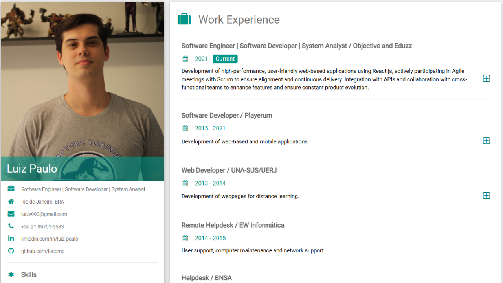

# Luiz Paulo - Portfólio

## 📌 Sobre o Projeto

Este é o meu portfólio pessoal, desenvolvido em **React** e **TypeScript**, utilizando **Vite** para o ambiente de desenvolvimento. O objetivo é apresentar minha experiência profissional, habilidades, formação e contatos de forma organizada e acessível.


## 🚀 Tecnologias Utilizadas

- **React 18**
- **TypeScript**
- **Styled Components**
- **Vite**
- **ESLint e Prettier**


## 💻 Como Rodar o Projeto

### 1️⃣ Clonar o Repositório

```sh
git clone https://github.com/lpcomp/luiz-portfolio.git
```

### 2️⃣ Instalar as Dependências

```sh
cd luiz-portfolio
npm install
```

### 3️⃣ Rodar em Ambiente de Desenvolvimento

```sh
npm run dev
```

### 4️⃣ Gerar a Versão de Produção

```sh
npm run build
```

### 5️⃣ Rodar a Build Localmente

```sh
npm run preview
```


## 🔧 Ferramentas de Desenvolvimento

O projeto conta com as seguintes ferramentas para garantir qualidade de código e boas práticas:

- **ESLint**: Para análise estática de código.
- **Prettier**: Para formatação automática do código.
- **TypeScript**: Tipagem segura e melhor manutenção.


## 📬 Contato

📧 Email: [luizv993@gmail.com](mailto\:luizv993@gmail.com)\
💼 LinkedIn: [linkedin.com/in/luiz-paulo](https://www.linkedin.com/in/luiz-paulo-ba%C3%A7al-de-vasconcelos/)\
🐙 GitHub: [github.com/lpcomp](https://github.com/lpcomp)\
📍 Localização: Rio de Janeiro, BRA


## 📸 Captura de tela


